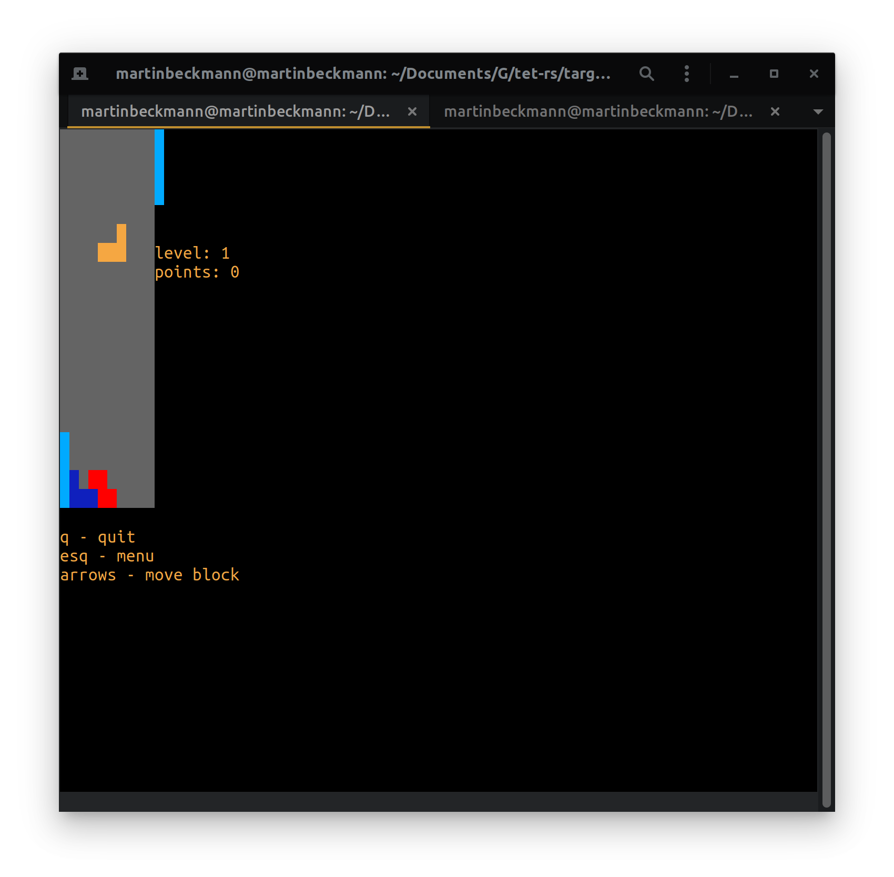
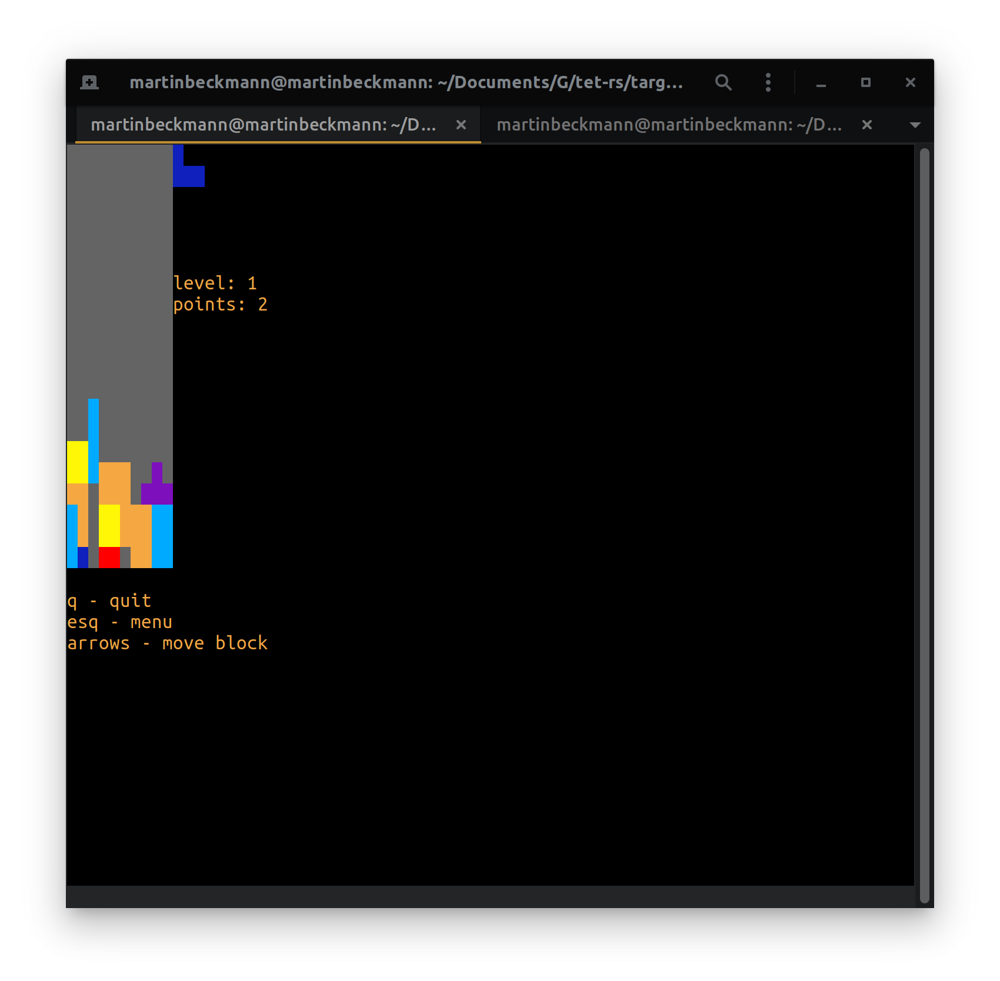
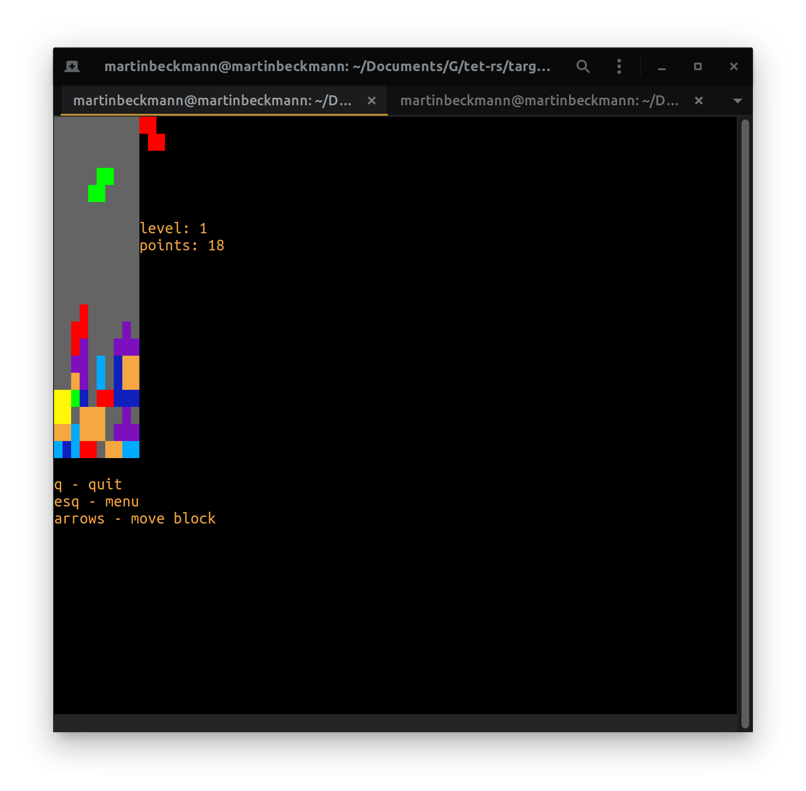

# Tet-rs
This is a simple version of tetris for the terminal written in Rust as a hobby to learn Rust more deeply.  
I use async-IO powered with the tokio 0.2 runtime to reduce overhead and minimize unused CPU cycles.
To guarantee cross-platform support crossterm supplies event handling of the terminal.  

#### Screenshots

#### Personal Findings
Async-IO in Rust is very useful to maximize the time of your program to actually do useful work. But this comes at price.
In my experience it is not trivial to setup communication between many concurrent tasks and although the async-await syntax
of Rust made it a far better experience than using raw futures, it was always a time consuming part to setup the data within
the program.

Debugging your code in a program that heavily modifies the behaviour of the terminal hugely reduces the options to debug.
Starting the code from the IDE was not an option since it immediately crashes. The program simply wouldn't work with the 
terminal of the IDE. So using the graphical debugger flew out of the window.  
I haven't tried using the gdp CLI so that might still be an option. Although I suspect it to be also quiet uncomfortable.  
Printing debug messages might me an option with different print render logic but it didn't work so well with my program.  
At the end of the day I mostly used asserts to crash the program whenever I suspected weird behaviour. This worked quite 
well since Rusts assert output was verbose enough.

Profiling the code was actually extremely interesting. My initial implementation of the render logic was quite wasteful 
with heap allocations of strings. To come to that conclusion I used the perf tool on linux and man is that cool. It was 
first time I used it and was somewhat overwhelmed by the options. But the useful data generated by it is just insane. When
performance matters to you or your program you should definitely learn to use it well.

Adding a GUI to any program immediately makes it way more complicated. I developed web applications for 3 years and learned
to create good GUIs in the web. And although you have to jump through fewer hoops in web development a GUI can get hairy
pretty fast at scale. Obviously scale is not the case for this project but GUIs being harder in Rust (especially without a
framework) made it an additional non trivial problem to tackle.

Rust is a beautiful language. Many people (including myself) start fighting the borrow checker and just try to please it.
But when you learn how you are supposed to program in Rust everything gets simpler and Rust guides you to and rewards better
architectural decisions. After overcoming the first big hurdle of setting all the structures up properly its just a joy 
to program in Rust.

### Further Development
At this point I am content to stop here but whenever I feel the urge to invest more time into the project, there are still
things to do to create a round experience.

##### Things to implement
1. Stop game loop after losing the game
2. Handle scores  
    2.1. Add a view to commit your score to a leader board file  
    2.2. Add a view to display the contents of the leader board
3. Make it themeable

##### Tools to try
Some things of the current code base a quite repetitive. I currently have never written my own macros in Rust but I believe
that those are some good and simple use cases for that.

Since I didn't use the gdb CLI I should give it a try since using asserts is not a good or ergonomic way to debug code.

